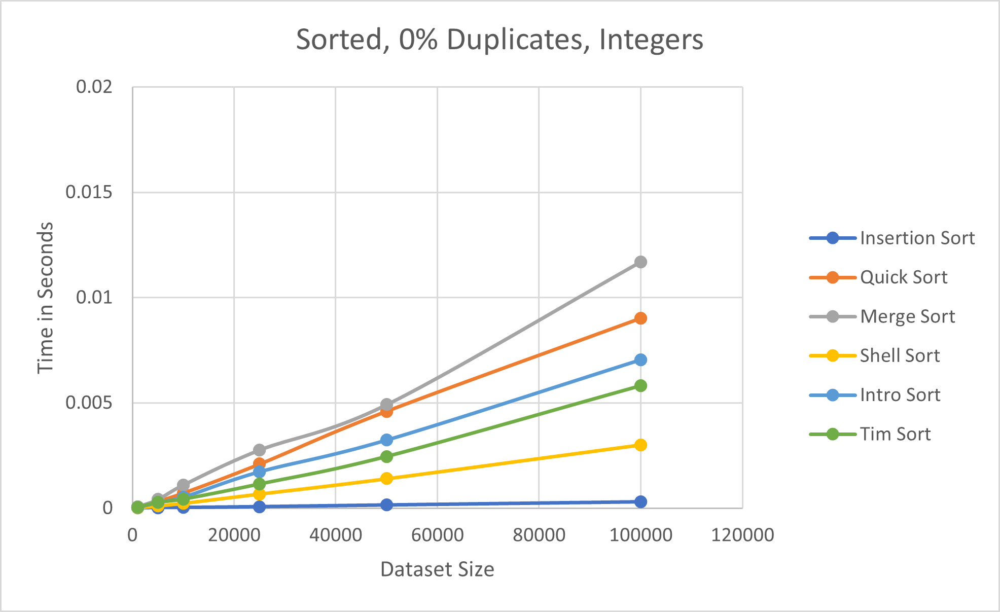
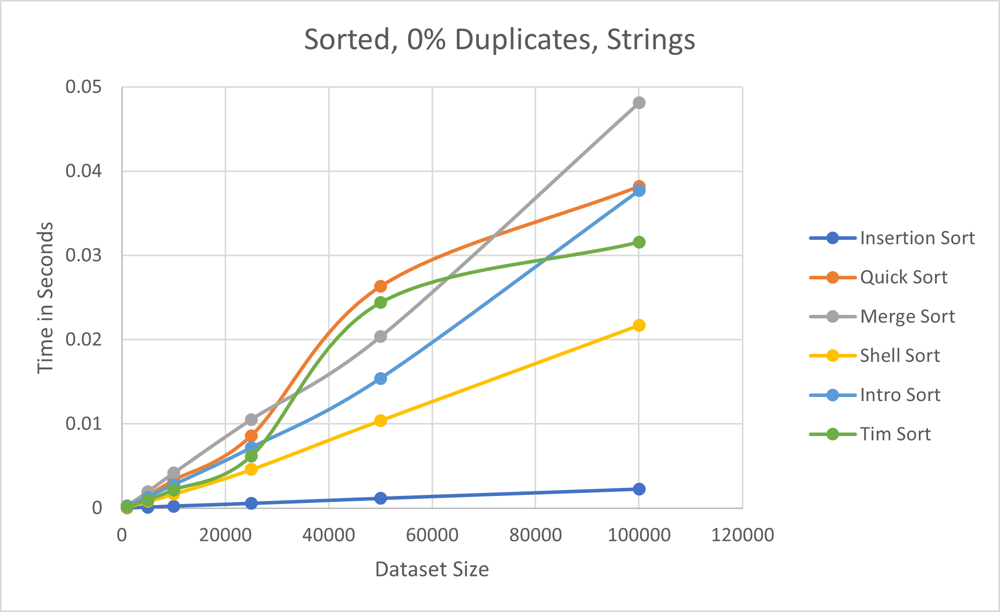
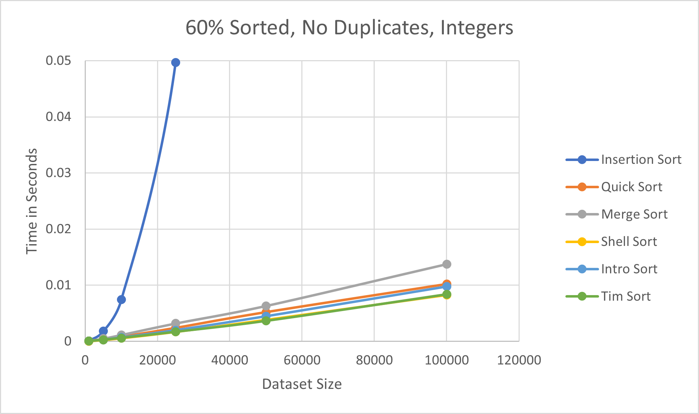
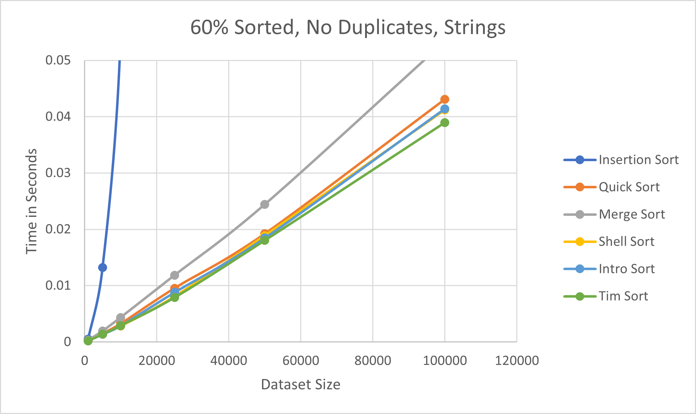
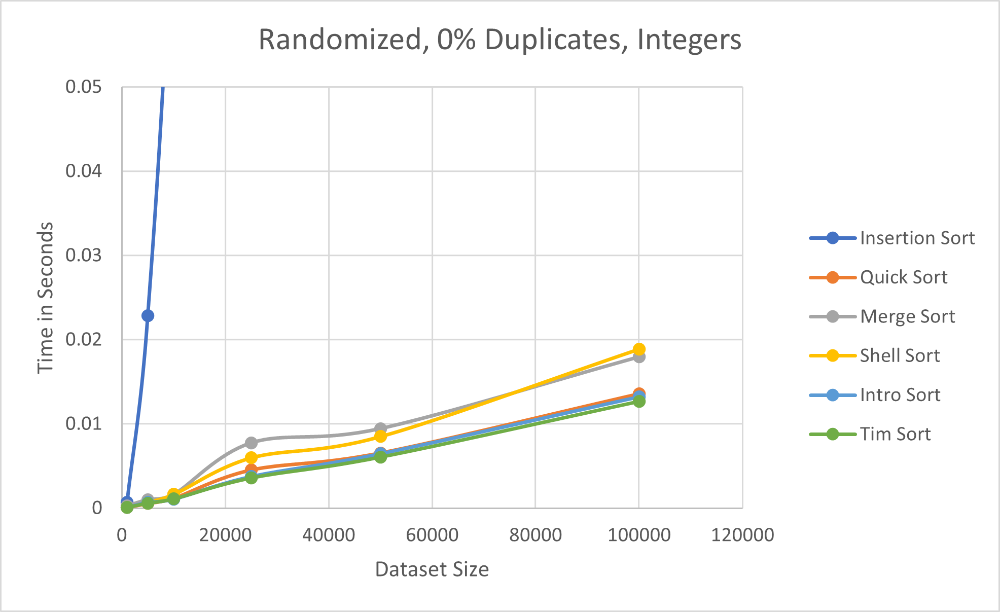
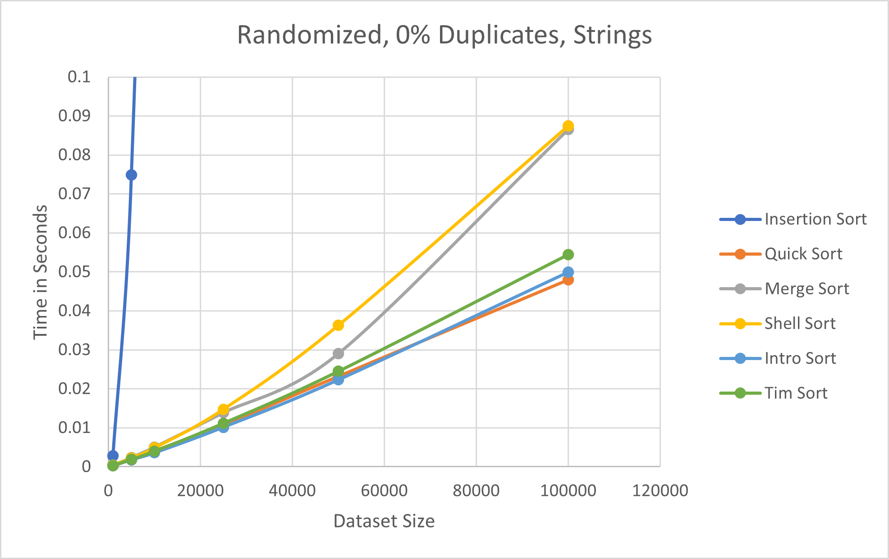
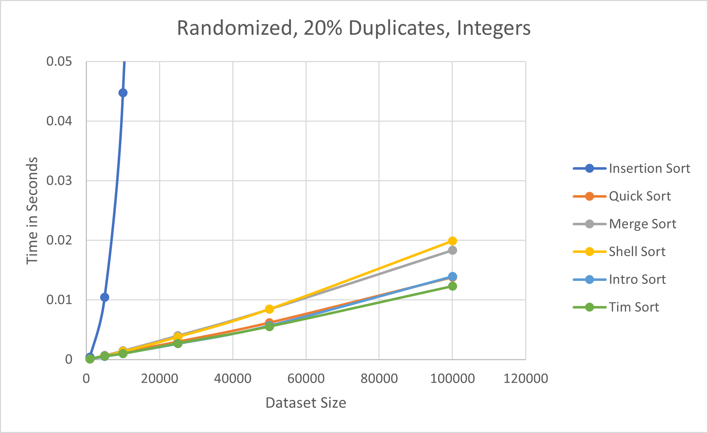
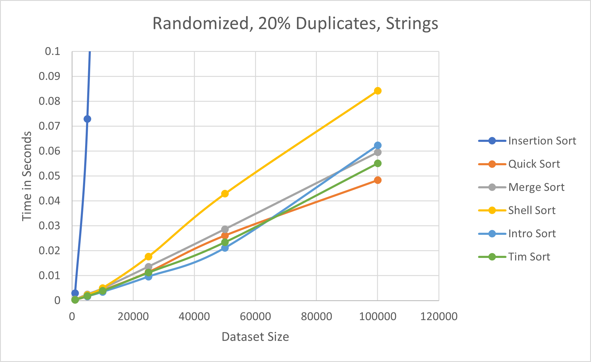
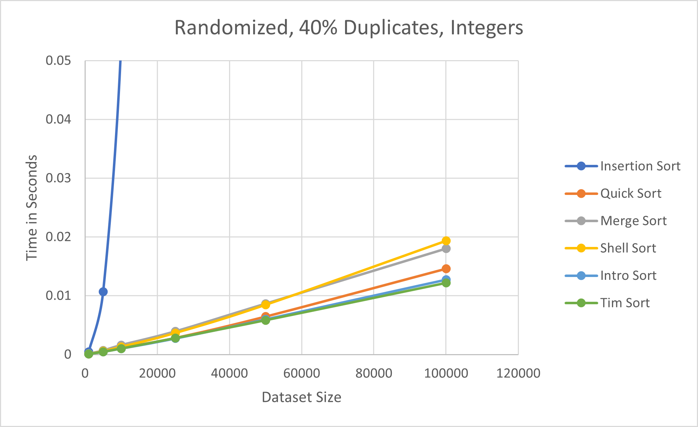
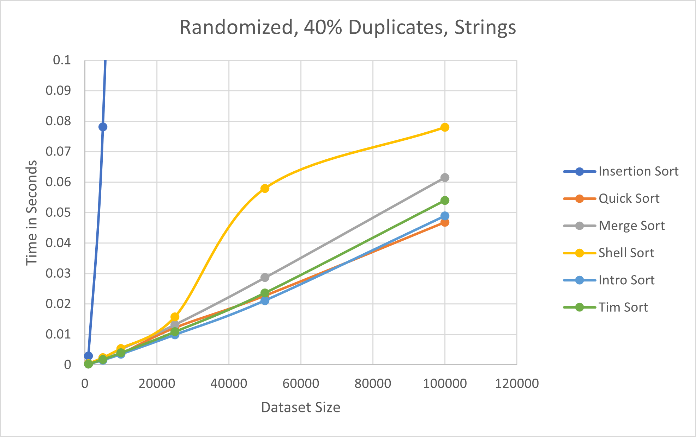

# PA 02: Sorting
by Michael Doherty

## Project Description
In this project, I needed to verify the upper bounds of the following six sorting algorithms:
- insertion sort
- randomized quicksort
- merge sort
- shellsort
- introsort
- timsort

Additionally, I needed to compare the performance of the sorting algorithms in the same Big-O class.
To do this, I needed to construct integer-based and string-based datasets. The following types of datasets were created:
- A randomized dataset with 0% duplicates
- A dataset with 0% duplicates sorted in ascending order
- A dataset with 0% duplicates with 60% of the dataset already sorted
- A randomized dataset with 20% duplicates
- A randomized dataset with 40% duplicates

Each type of dataset was created at six different sizes for both strings and integers (so a total of 60 datasets were created). The dataset sizes I chose were 1000, 5000, 10000, 25000, 50000, and 100000 elements.  

After generating the datasets and implementing the sorting algorithms, I needed to run each dataset through each of the six sorting algorithms and collect timing data using std::chrono. This data was then outputted to a csv file for data analysis.

## Building and Executing
To generate the datasets from the terminal, simply navigate to the DatasetGeneration folder and use the command:  
**python3 main.py**  

To build the sorting algorithms code from the terminal, simply navigate to the src folder and use the command:  
**g++ main.cpp SortingAlgorithms.h -o output**

(Note that after the -o, you can name the executable whatever you want). To run the sorting algorithms, simply type the command:  
**./output**  
(Again, note that output should be replaced with the name of your executable). No command line arguments are required for this program, as all file paths are already included in the source code.
## Sorting Algorithm Descriptions
### Insertion Sort
A simple sorting algorithm that splits the array into a sorted section and an unsorted section. It then iterates over the unsorted section, finding each value's correct position in the sorted section and placing it there.  
Average Time Complexity: O(n2)  
Best Case Time Complexity: O(n)
### Randomized Quick Sort
A Divide and Conquer algorithm that uses a random element in the array as a pivot and partitions the values in the array around that pivot.  
Average Time Complexity: O(n lg(n))  
### Merge Sort
A Divide and Conquer algorithm that splits the given array into two halves. It repeatedly calls itself, splitting each subarray in half until there is only 1 element left in each subarray. It then merges the subarrays, sorting the elements while doing so.  
Average Time Complexity: O(n lg(n))
### ShellSort
A variation of Insertion Sort. It sorts elements that are separated by a given interval. It then reduces the interval, repeating the process until the whole array is sorted.  
Average Time Complexity: O(n lg(n))
### IntroSort
A comparison based, hybrid sorting algorithm that combines three different sorting algorithms. It begins by using Randomized Quick Sort to sort the array. If one of the subarrays generated by QuickSort has less than 16 elements, then it uses Insertion Sort to sort that subarray. If, after a certain number of recursive calls using QuickSort, it reaches a "depth limit" (which is calculated as 2 * log(array_size)), it will sort the subarray using HeapSort. Otherwise, it will sort the subarray using QuickSort.  
Average Time Complexity: O(n lg(n))
### TimSort
A hybrid sorting algorithm that uses Insertion Sort and Merge Sort. It divides the given array into blocks of 32 elements, sorts each block using Insertion Sort, and then merges each block using the merging capability of Merge Sort.  
Average Time Complexity: O(n lg(n))
## Report Questions
1) How did you generate the various data sets?
      - I generated the various data sets in Python. 
      - For the integer data sets, if there were no duplicates, then I simply iterated through a for loop the size of the data set, adding 0 - (size - 1) to the data set. If any part of the data set needed to be randomized, then I used another for loop the size of the data set to generate random indices in the approriate range and swap the values at those indices. If any part of the array had duplicates, then I would use two for loops, both starting from i = 0, to generate the data (1 the size of the percent of the data set that needed to be duplicated, the other the remaining values needed for the data set). (Ex: If 20% of values in a size 100 data set needed to be duplicated, then I would first generate 20 values starting from 0, then generate 80 more values starting from 0, meaning the resulting dataset would have every number from 0 - 19 in it twice).
      - For the string data sets, I generated 4 character strings that only had lowercase letters. I incremented each string by one letter as needed to form new strings, resetting the letters after they reached 'z' (Ex: 'aaaa' incremented to 'aaab', and 'aazz' incremented to 'abaa'). Like above, if any part of the data set needed to be randomized, then I used a for loop to generate random indices in the appropriate range and swap the values at those indices. If values needed to be repeated, then I would call my function that generated strings twice, once with size being the percent of values that needed to be duplicated, and once with the remaining size needed to be generated to complete the data set. Both function calls would start from 'aaaa'. (Ex: If 20% of values in a size 100 data set needed to be duplicated, then I would first generate 20 values starting from 'aaaa', then generate 80 more values starting from 'aaaa').
2) How does the performance of the various sorting algorithms differ between randomized data and pre-sorted data? Does this change with integers vs strings?
      - All of the sorting algorithms performed better when more of the data was sorted, regardless of the data type. The sorting algorithms were fastest on the datasets that were already sorted, followed by the datasets that were 60% sorted, followed by the completely randomized datasets. The most noticable improvement was in InsertionSort, which became significantly faster the more the data was already sorted. This was true for both data types; in other words, the algorithms were faster the more the data was sorted for both integers and strings.
3) How do the algorithms perform as the datasets grow very large?
      - Out of all the algorithm's, only Insertion Sort's time increased dramatically as the dataset sizes grow larger (every dataset other than Insertion Sort consistently performed in less than .1 seconds, while Insertion Sort's longest runtime was about 31 seconds for the randomized string datasets of size 100000). Overall, this matches the Big-O of each algorithm, as Insertion Sort's is on average O(n2), while the other 5 sorting algorithms are on average O(n lg(n)). Nevertheless, each algorithm's runtime increased as size increased (as one would expect).
4) Does the performance of the sorting algorithms match published upper bounds?
      - Yes, the sorting algorithm's runtimes match their published upper bounds. Insertion Sort, the only algorithm I tested with a published upper bound of O(n2), was consistently the worst out of all 6 sorting algorithms on randomized or partially randomized datasets; this was expected, as Randomized Quick Sort, Merge Sort, ShellSort, IntroSort, and TimSort all have published upper bounds of O(n lg(n)). This is reflected in their runtimes, as all were relatively close in value for all datasets and data types. Additionally, InsertionSort's best case runtime of O(n) when the dataset is already sorted was reflected in its runtime for the already sorted datasets, as it was faster than the other sorting algorithms for those datasets (as the other sorting algorithms are still O(n lg(n)) for already sorted datasets).
5) How does the performance of the algorithms change as duplicates are introduced?
      - The sorting algorithms were often slightly faster when there were more duplicates present in the dataset. However, overall, these changes were generally very small and did not impact the runtime by that much; sometimes the runtimes actually slightly increased when there were duplicates. This leads me to believe that overall, the prescence of duplicates does not significantly affect the runtime of these sorting algorithms.
6) How does the performance of the algorithms change when the input is mostly sorted?
      - All of the sorting algorithms were faster when the input was mostly sorted than when the input was completely randomized. For InsertionSort, the difference was extremely significant; it took InsertionSort 31.89 seconds to sort the 100000 element dataset of strings that was completely randomized, while it only took it 5.39 seconds for it to sort the 100000 element dataset of strings that was already 60% sorted. ShellSort was also generally twice as fast when the dataset was 60% sorted than when it was completely randomized. Overall, every algorithm's runtime improved when some of input was already sorted.
7) Which algorithm is the best?
      - To determine the best overall algorithm, I ranked each algorithm from 1 - 6 according to their runtime (with 1 being the fastest and 6 being the slowest) for each input file and averaged their ranking (thus I used 60 data points for each algorithm, which should give me a solid understanding of which is the best). Using this method, I found that TimSort was the fastest sorting algorithm across both types of datasets, followed by IntroSort and QuickSort, respectively. However, I also discovered that, on average, IntroSort was faster than TimSort when sorting strings; nevertheless, overall TimSort is the best sorting algorithm on the 6 sorting algorithms I implemented. The full rankings can be seen below.  

Full Rankings:
- Integer Datasets  
      1) TimSort  
      2) IntroSort  
      3) ShellSort  
      4) QuickSort  
      5) MergeSort*   
      6) InsertionSort 
- String Datasets  
      1) IntroSort  
      2) TimSort  
      3) QuickSort  
      4) ShellSort  
      5) MergeSort  
      6) InsertionSort  
- All Datasets  
      1) TimSort  
      2) IntroSort  
      3) QuickSort  
      4) ShellSort  
      5) MergeSort  
      6) InsertionSort  

* (I ranked MergeSort above InsertionSort for the Integer Datasets even though its average ranking was slightly lower than InsertionSort's. I did this because MergeSort's average ranking was only lower because it was consistently the worst of the O(n lg(n)) sorting algorithms, while InsertionSort is by far the fastest sorting algorithm when the dataset is already completely sorted. The 6 first place finishes for InsertionSort (all when the data was already sorted) allowed it to slightly beat out MergeSort in average ranking; however, InsertionSort's runtimes for all other arrangements of data was significantly worse than MergeSort's, meaning it's clearly the inferior sorting algorithm.)

## More Analysis
From my data, it's extremely apparent that all of the sorting algorithms took longer to sort the string datasets than the integer datasets, on average. Thus, it can be reasonably concluded that it's easier for each of the 6 sorting algorithms to sort integer data than string data.   
My data also shows that the two hybrid sorting algorithms I implemented, TimSort and IntroSort, are the best sorting algorithms out of the six algorithms I implemented. It seems their ability to combine the best aspects of multiple sorting algorithms makes them faster and more efficient at sorting data, leading me to conclude that hybrid sorting algorithms are generally the fastest sorting algorithms.  

The graphs for every type of dataset used can be seen below (all graphs are plotted as Time in Seconds vs. Dataset Size) (note that not all of the graphs are on the same scale; this is because some graphs needed different Time in Seconds scales to best show the difference between the different algorithms):  

